# Cyber-security-network-design

Network design using Cisco Packet Tracer for a university computer lab. 

I designed this network as part of 
the coursework for my Secure Communication Networks module at Cardiff University. It is based off the
following scenario:

*"You have been asked to design a Cyber Security network for use by Cyber
students, sandboxed from the main University Campus Area Network. The network
will be split across two rooms, and will need to include student PCs, laptop access,
Staff PC, and an IT Admin PC. Students will need access to a printer and may wish to
connect IoT / OT devices for testing. You may wish to consider additional physical
security control measures for the rooms."*

## Network design

This network design accommodates a range of devices used across two classrooms.

Assumptions I have made from the scenario:
- The network is sandboxed from the University Network, so the network must be physically
isolated and all external traffic should be untrusted by default.
- The two classrooms will have 30-40 students each who each need access to a wired PC.
- There will be 1-3 staff members in each room who also need access to a wired PC.
- Staff and students will have wireless devices which will also need network access.
- Students and staff will need shared access to printers and IoT devices.
- The lab needs its own local services separate from the University.
- Guest access is required.

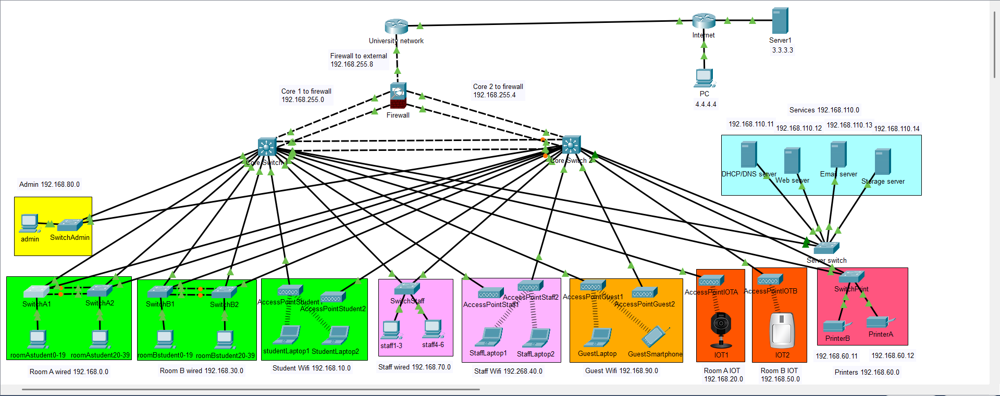

The network is segmented to provide separate access levels for students, staff, guests, admin, IoT
devices, printers and servers. Student and staff networks are further separated by connection type
and additionally students and IoT into room A and B to minimise broadcast domains.

The admin PC, along with all servers and network devices, will be kept in a third secure room. This
room will be kept locked and restricted from all except administrators.

Services that the lab offers include:
- HTTPS – Useful for demonstrations, students could use for testing.
- DHCP/DNS – Assigns addresses for the network and gives a domain name to the web server.
- SMTP/POP3 – Email is essential for any modern school environment.
- FTP – Students and staff can store files locally.
- IoT – Useful for both security and teaching purposes.

Using routers to segment this network would require a large web of devices and cabling, resulting in
a high costing and difficult to maintain network. Taking inspiration from Cisco’s Collapsed Core
design, I have decided to use a layer of redundant multilayer switches instead of routers to route
traffic between subnets. This makes the network more accessible, scalable and efficient.
The gateway to the network is guarded by an ASA firewall which monitors and restricts inbound
traffic.

Following guidance from NetworkLessons.com, I have configured an IPsec site-to-site VPN between
the two ASAs to simulate secure remote access. However, I didn’t manage to get the encryption to
function in practice.

## Subnetting scheme

| Description | End devices | Network Id | Subnet mask | Usable hosts | DHCP pool | VLAN | Access group |
|--|--|--|--|--|--|--|--|
| Room A Wired | 40 | 192.168.0.0/26 | 255.255.255.192 | 62 | 192.168.0.11 – 192.168.0.50 | 10 | student |
| Student WiFi | 100 | 192.168.10.0/25 | 255.255.255.128 | 126 | 192.168.10.11 – 192.168.10.110 | 11 | student |
| Room A IoT | 100 | 192.168.20.0/25 | 255.255.255.128 | 126 | 192.168.20.11 – 192.168.20.110 | 12 | IoT |
| Room B Wired | 40 | 192.168.30.0/26 | 255.255.255.192 | 62 | 192.168.30.11 – 192.168.30.50 | 13 | student |
|Staff WiFi | 100 | 192.168.40.0/25 | 255.255.255.128 | 126 | 192.168.40.11 – 192.168.40.110 | 14 | staff |
|Room B IoT | 100 | 192.168.50.0/25 | 255.255.255.128 | 126 | 192.168.50.11 – 192.168.50.110 | 15 | IoT |
|Printers | 2+ | 192.168.60.0/27 | 255.255.255.224 | 30 | Static | 16 | printer |
|Staff wired | 6+ | 192.168.70.0/27 | 255.255.255.224 | 30 | Static | 17 | staff |
|Admin | 1+ | 192.168.80.0/27 | 255.255.255.224 | 30 | Static | 18 | admin |
|Guest WiFi | 100 | 192.168.90.0/25 | 255.255.255.128 | 126 | 192.168.90.11 – 192.168.90.110 | 19 | guest |
|Services | 4+ | 192.168.110.0/27 | 255.255.255.224 | 30 | Static | 21 | server |
|Core 1 to firewall | 2 | 192.168.255.0/30 | 255.255.255.252 | 2 | Static | 100 | internal |
|Core 2 to firewall | 2 | 192.168.255.4/30 | 255.255.255.252 | 2 | Static | 101 | internal |

### Subnets have been chosen to separate traffic by trust level.

- Students and staff need access to all the lab’s services, the internet, printers and IoT devices.
- Staff also need to be able to communicate with student and guest devices for supervision.
- IoT, printers and servers should be restricted from initiating communication with other
subnets and should only be able to respond using essential services only.
- Guests should be restricted to web/DHCP services and internet only.
- Admins need unrestricted access across the network, and all subnets must be able to
communicate to the admin subnet.

### Addresses are given a consistent scheme to assist management.

- Plenty of space has been left between each subnet for future growth.
- .1 is always the default gateway for each subnet
- .2 - .10 are reserved for network devices, as recommended by LearnTech Training on
YouTube
- All end device addresses start from .11
Subnets are chosen to fit end devices comfortably while allowing for growth.
- Student wired subnets are given /26 networks to comfortably fit 40 PCs per room to
accommodate large classes.
- All Wi-Fi subnets are given /25 networks to fit 100 devices.
o Users will likely have 2+ wireless devices.
o On some occasions a higher number of guests or staff may need access to the
network, such as during open days or conferences.
- Smaller subnets are given a larger-than-needed /27 network.
o While there is only one device in the admin network now, admins may want to set
up additional devices for security and monitoring.
o Similarly, staff members may need more wired connections for additional devices.
o Other devices such as backup servers may be added to the services subnet.
- Point to point subnets only need 2 addresses so are assigned /30.

## Networking services and protocols

Suppose a student on a wired PC in room A presses send on an email.
- 7-Application layer – Student’s email
application will use SMTP to communicate with
the lab’s email server and wraps the message
data accordingly.
- 6-Presentation layer – Encoded using the MIME
protocol to preserve uncommon data types
such as foreign characters. All SMTP data is
encrypted using TLS.
- 5-Session layer – A TLS session is established.
- 4-Transport layer – TCP breaks the data into
segments, adding headers:
  - Source port – a random port on the
student PC.
  - Destination port – SMTP uses port 25.
  - Sequence number – Ensures data is
reassembled correctly.
  - Acknowledgement number – Confirms
that data has been received.
  - Checksum – Detects missing data,
which is to be retransmitted.
- 3-Network layer – IP encapsulates each
segment with:
  - Source IP – Student PC.
  - Destination IP – Email server.
  - A time-to-live.
  - Checksum – Detects IP corruption.
- 2-Data link layer – Ethernet adds the following headers:
  - Source MAC – Student PC.
  - Destination MAC – The PC checks its ARP table and adds the MAC of the default
gateway.
- 1-Physical layer – Packets are converted to electric signals and leave through the NIC onto
copper cables.

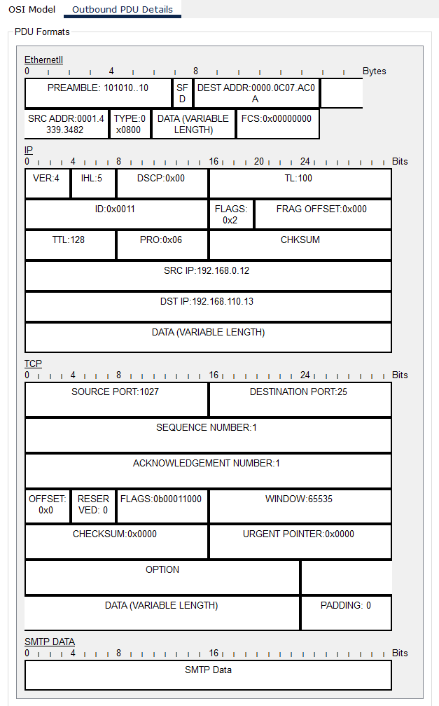)

Now suppose a student connected by Wi-Fi uploads a file to the
storage server remotely.
- 7 – FTP creates metadata for the file such as a filename. It
uses a control channel and a data channel.
- 6 – Data may be compressed for faster transfer.
- 5 – Two separate sessions are kept for control and data.
- 4 – TCP segments data and adds headers:
  - Destination port – 21 for control, random for
data.
  - Source port is random.
  - Sequence numbers and checksums.
- 3 – IPs of the student device and server are added, along
with a TTL and header checksum.
- 2 – Wi-Fi adds the headers:
  - MAC 1 – Student device.
  - MAC 2 – The Wireless Access Point.
  - MAC 3 – The identifier of the wireless network.
- 1 – NIC converts data to radio waves and transmits them
through the air. The WAP receives them and converts
them back into electric signals, before forwarding to the
core.

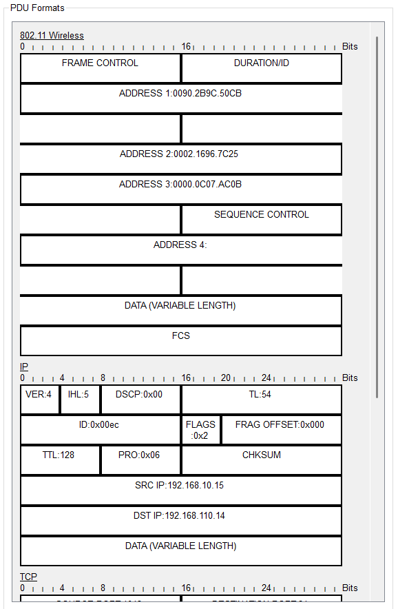)
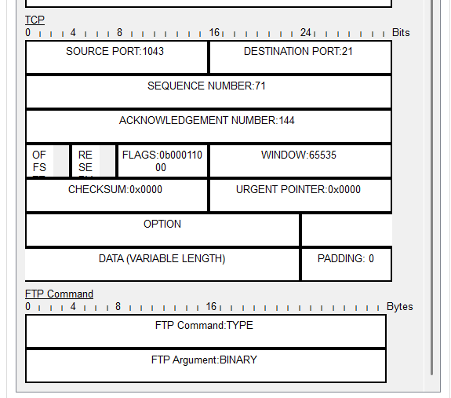)

Now suppose another student on a wired PC types ‘securelab.net’
into their browser.
- 7 – The browser generates a DNS query. Once the web
server’s IP is known it sends an HTTPS request.
- 6 – HTTPS uses TLS to encrypt all traffic.
- 5 – A HTTPS session is established once the DNS query is resolved.
- 4 – DNS uses UDP, whereas HTTPS uses TCP. Both add headers:
  - Random source port.
  - Destination port of 53 for DNS, 443 for
HTTPS.
  - Checksum.
  - Only TCP uses a sequence and
acknowledgement number.
- 3 – IP adds the headers:
  - Source IP – Student PC.
  - Destination IP – First the DNS server, then
the web server for HTTPS.
  - TTL and checksum.
- 2 – Ethernet adds:
  - Source MAC – Student PC
  - Destination MAC – Default gateway from
PC’s ARP table.
- 1 – Data is sent out the NIC onto copper cables.

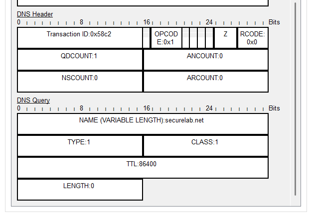)

Routing/switching
- When receiving packets from end devices, the
access switch or WAP checks its MAC table and
forwards them via Ethernet to the core.
- Packets sent to the standby core switch are
dropped by HSRP.
- The active core switch decapsulates packets to layer
3, decrements TTL and recognises the destination IP as belonging to the services VLAN.
- After checking its ARP table, the core re-encapsulates packets with the respective server’s
MAC.
- Packets are forwarded to the services access switch, before finally reaching the server where
they are decapsulated and the application layer data is processed.
- The same process is applied on return of packets.

## Network Security and Availability (A)

One primary security mechanism implemented is the use of Access Control Lists on the core
switches and ASA firewall. ACLs restrict traffic by analysing packets at layer 3 and 4, ensuring only
authorised devices can access specific services. I have given hosts only the minimum permissions
they require, upholding the least privileges principle.

On my core ACL for example I have configured the services ACL to only permit the return traffic
needed to respond to users, and an explicit deny at the end blocks all other traffic. On the ASA
firewall, access into the network is restricted to web and email servers only using their required
ports. This reduces the risk of network scanning, brute force attempts and malware delivery.
Confidentiality is upheld by preventing unauthorised access.

To help uphold integrity I have implemented DHCP snooping, as recommended by CCNA Practical
Labs. DHCP snooping prevents untrusted servers from assigning addresses to devices. This helps to
prevent man-in-the-middle attacks where an attacker pretends to be a DHCP server and intercepts
traffic. Only the port connecting my trusted DHCP server is allowed to send DHCP responses.
Additionally, I have helped to ensure availability by applying rate-limits to each of the core’s SVIs to
prevent DHCP starvation attacks.

DHCP snooping automatically builds a list of trusted IP-MAC bindings, enabling me to activate
Dynamic ARP Inspection. DAI inspects traffic and blocks any ARP responses that do not match these
trusted bindings, further upholding integrity by preventing ARP poisoning attacks.

To simulate secure remote access, I have attempted to implement an IPsec site-to-site VPN to a
remote student’s network. This would encrypt all traffic and authenticate both endpoints, insuring
confidentiality and integrity when data is passing through untrusted networks.

Admin access to network devices is also secure, devices are password protected and would have
physical management ports blocked off. Management is permitted only to the admin network via
SSH. The admin room will be kept locked with key-card access. 24/7 CCTV will run internally and at
all entrances to the lab. These measures help to ensure confidentiality by preventing tampering.

To further uphold the confidentiality and integrity of my network I should implement a central
Authentication, Authorization and Accounting server. This would ensure only authenticated users
can access the network and provide a log of admin activity. To avoid compromising availability, a
backup AAA server would be needed to prevent a single point of failure.

### Configurations

*Core switch ACL*

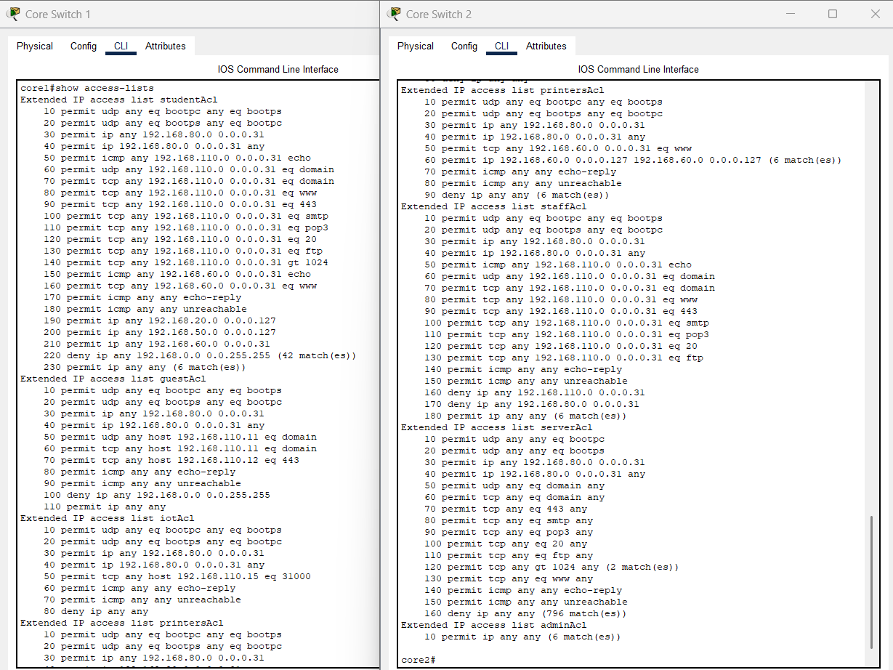

*Firewall ACL*

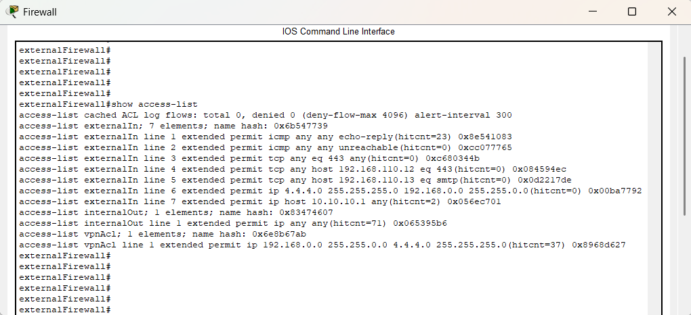

*DHCP snooping and ARP inspection*

*Core switch password protection and SSH access*

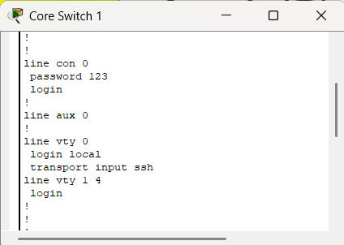

*Firewall ssh access and IPsec encryption*

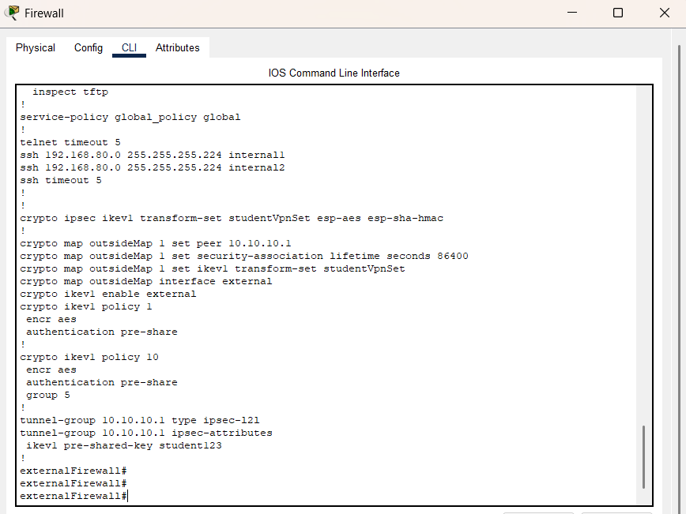)

*Remote student’s IPsec encryption*

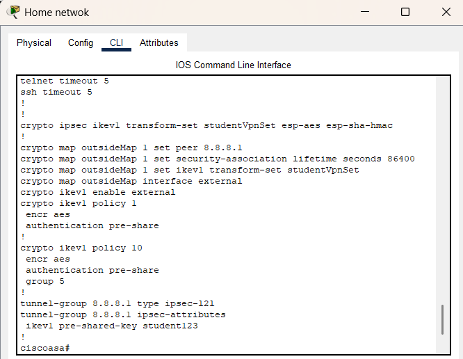

## Network Security and Availability (B)

The core layer of my topology consists of two redundant multilayer switches.
- Configured with HSRP to provide a virtual interface shared between both devices.
- For each VLAN, one switch acts as active and one remains standby.
- Each access switch connects to both core switches.
- If one switch fails, the standby is promoted to active. Devices using the virtual interface do
not need to change configuration.
- Constant HSRP ‘hello’ messages keep failover time to a few seconds.

Similarly, my ASA firewall uses EtherChannel to bundle internal interfaces into single logical links.
This provides redundancy whilst also increasing bandwidth. If a single or link has a malfunction,
HSRP/EtherChannel automatically keeps the network running. This prevents single points of failure
and ensures availability even during faults.

High performance is ensured by using hardware level inter-VLAN routing, providing lower latency
and higher throughput compared to software-based routing.

Network performance and availability can be measured using metrics such as:
- Failover time – How quickly redundancy methods take effect.
- Packet loss/latency – Indicates congestion or link failures.
- Throughput – Shows how efficiently bandwidth is being used.
- Uptime – Shows the overall network dependability.

### Configurations

*Core switch SVIs shared using HSRP*

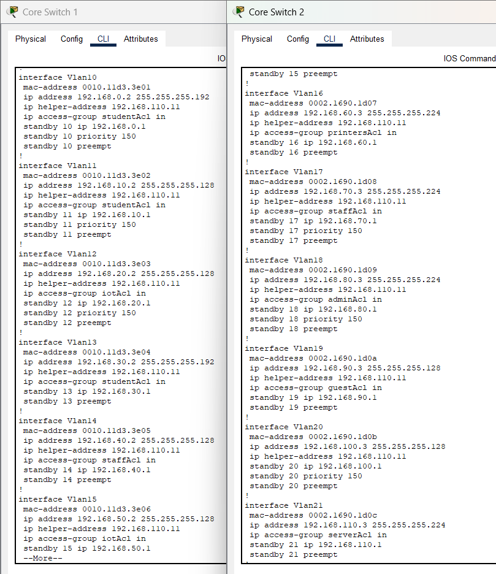

*EtherChannel interfaces on firewall*

